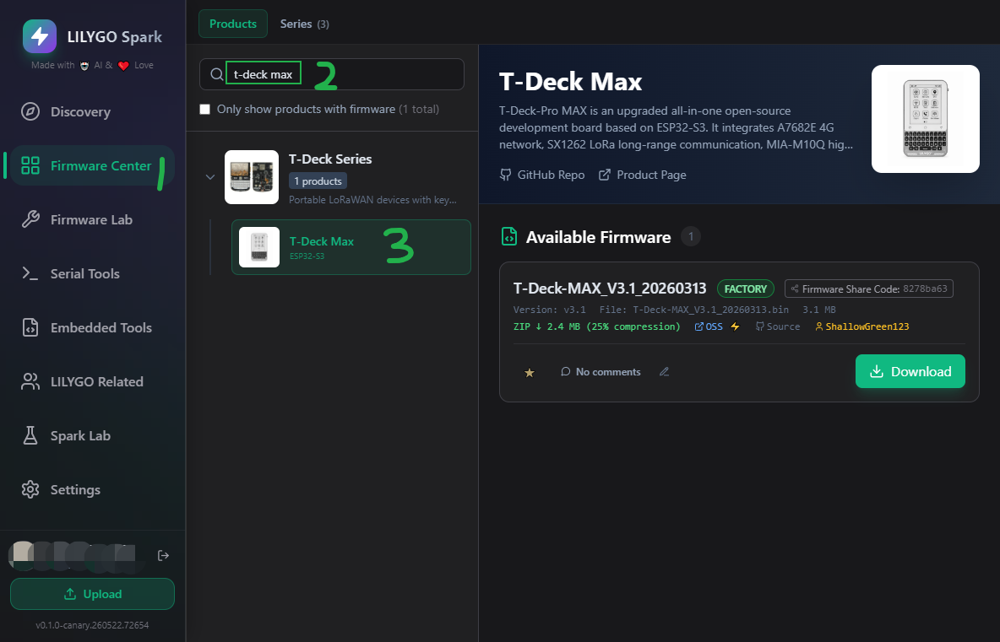

<h1 align = "center">🏆T-Deck-MAX 🏆</h1>

|  [中文](./readme_cn.md) |  [English](./readme.md) |
| --- | --- |

 
<!-- </a> -->
</a>
</a>

| Front | Back |
| :---: | :---: |
|  |  |

## :zero: Version 🎁

**T-Deck-MAX** Revision Update Notes: 

- Added the XL9555 IO expansion chip 

- Remove the distinction between the audio version and the 4G version. Now, integrate the 4G (A7682E) and the audio (ES8311) onto a single board. 

- Add a LoRa antenna selection switch, controlled by XL9555 to select the internal or external antenna. The default is the internal antenna. 

- Add an audio channel output selection switch, and control the selection of using A7682E / ES8311 audio output through XL9555. 

- Add the vibration motor driving chip DRV2605

### 1、Version

How to confirm that your device is `T-Deck-MAX`?

Download the [WireScan](./firmware/examples/WireScan.bin) firmware and then open the serial port to confirm.

How to download the firmware? - [click me](./firmware/)

### 2、Where to buy.

[LilyGo Store](https://lilygo.cc/products/t-deck-pro)

## :one: Product 🎁

|     Parameter    |      T-Deck-MAX            |
| :--------------: | :----------------------------: |
|       MCU        |            ESP32-S3            |
|  Flash / PSRAM   |            16M / 8M            |
|       LoRa       |             SX1262             |
|       GPS        |            MIA-M10Q            |
|     Display      |      GDEQ031T10 (320x240)      |
|    4G-Module     |             A7682E             |
| Battery Capacity |          3.7V-1500mAh          |
|   Battery Chip   | SY6970 (0x6A), BQ27220 (0x55) |
|      Audio       |         ES8311 (0x18)          |
|      Touch       |         CST328 (0x1A)          |
|    Gyroscope     |        BHI260AP (0x28)         |
|     Keyboard     |         TCA8418 (0x34)         |
|   IO Expansion   |         XL9555 (0x20)          |
|      Motor       |         DRV2605 (0x5A)         |

## Flashing Firmware 🎁

Before flashing firmware, connect the device to your computer, select the correct COM port, and put the board into download mode:

1. Press and hold the `BOOT` button.
2. Press and release the `RST` button on the back.
3. Release the `BOOT` button.

### 2.1. Use `LILYGO Spark` to Flash Firmware (Recommended)

- Download the tool from [LILYGO Spark](https://lilygo.cc/en-us/pages/lilygo-spark?srsltid=AfmBOoorTB7ptFu2LQNLRnoI2SA0zBGJTN6JpI9J3hmHEkKhBQSmeu0Y).

- Search for your device `T-Deck Max` and download the corresponding firmware.

| Firmware                              | Note                | Github                                                                |
| ------------------------------------- | ------------------- | --------------------------------------------------------------------- |
| T-Deck-MAX_xxxxx.bin                  | Factory program  | -                                                                     |
| crosspoint_lilygo_t_deck_max_xxxx.bin | Reader program      | [TDeckMax-Reader](https://github.com/ShallowGreen123/TDeckMax-Reader) |

## :two: Module 🎁

### 1. A7682E

A7682E https://en.simcom.com/product/A7682E.html

A7682E is the LTE Cat 1 module that supports wirelesscommunication modes of LTE-FDD/GSM/GPRS/EDGE.   It supports maximum 10Mbps downlink rate and 5Mbps uplink rate. A7682E supports multiple built-in network protocols.

Insert the SIM card and it supports calls, text messages and internet access.

Test the functionality of the A7682E using [`examples/A7682E/test_AT`](https://github.com/Xinyuan-LilyGO/T-Deck-Pro/tree/master/examples/A7682E/test_AT)

Control Via AT Commands
~~~
Frequency Bands LTE-FDD B1/B3/B5/B7/B8/B20
GSM/GPRS/EDGE 900/1800 MHz
Supply Voltage 3.4V ~ 4.2V, Typ: 3.8V
LTE Cat 1   (Uplink up to 5Mbps, Downlink up to10Mbps)
EDGE        (Uplink/Downlink up to 236.8Kbps)
GPRS        (Uplink/Downlink up to 85.6Kbps)
Firmware update via USB/FOTA
Support language calls
Support sending and receiving SMS messages
network protocols (TCP/IP/IPV4/IPV6/Multi-PDP/FTP/FTPS/HTTP/HTTPS/DNS)
RNDIS/PPP/ECM
SSL
~~~
❗ Note: The speakers of A7682E and ES8311 are shared. Set `IO12` of `XL9555` to `HIGH` and output the audio of A7682E.
The sound is too weak. Set `IO06` of the `XL9555` to `HIGH` to enable the power amplifier. [example](./examples/A7682E/test_AT/test_AT.ino)

### 2. ES8311

❗ Note: The speakers of A7682E and ES8311 are shared. Set `IO12` of `XL9555` to `LOW` and output the audio of ES8311.
The sound is too weak. Set `IO06` of the `XL9555` to `HIGH` to enable the power amplifier.

### 3. LoRa

❗ Note:
| When using the internal antenna, set `IO04` of `XL9555` to `HIGH`.  When using an external antenna, set `IO04` of `XL9555` to `LOW`.  The current repository uses `HIGH` for internal and `LOW` for external antenna selection. |
| :---------------------------------------------------------------------------------------------------------------------------------------------------------------------------------------------------------------------------------- |
|  |

## :three: Examples 🎁

The following lists all examples to help you quickly get started with each module:

| Example | Path | Description |
| :--- | :--- | :--- |
| **WireScan** | `examples/WireScan/` | I2C device scanner, open serial monitor after flashing to verify modules |
| **test_wifi** | `examples/test_wifi/` | WiFi connection test |
| **test_BHI260AP** | `examples/test_BHI260AP/` | Gyroscope (BHI260AP) test |
| **test_GPS** | `examples/test_GPS/` | GPS (MIA-M10Q) module test |
| **keypad** | `examples/keypad/` | Keyboard input test |
| **XL9555/read** | `examples/XL9555/read/` | IO expansion chip read example |
| **XL9555/write** | `examples/XL9555/write/` | IO expansion chip write example |
| **Elink_paper/touch** | `examples/Elink_paper/touch/` | Touch screen basic test |
| **Elink_paper/display** | `examples/Elink_paper/display/` | E-paper screen display example |
| **Elink_paper/test_lvgl** | `examples/Elink_paper/test_lvgl/` | LVGL graphics library example |
| **Elink_paper/GDEQ031T10_Arduino** | `examples/Elink_paper/GDEQ031T10_Arduino/` | E-paper Arduino library driver example |
| **LoRa_sx1262/lora_send** | `examples/LoRa_sx1262/lora_send/` | LoRa send example |
| **LoRa_sx1262/lora_recv** | `examples/LoRa_sx1262/lora_recv/` | LoRa receive example |
| **A7682E/test_AT** | `examples/A7682E/test_AT/` | 4G module AT command test |
| **ES8311/playWAV** | `examples/ES8311/playWAV/` | WAV audio playback example |
| **ES8311/playFormSD** | `examples/ES8311/playFormSD/` | Audio playback from TF card example |
| **battery/bq25896** | `examples/battery/bq25896/` | Battery management IC BQ25896 test |
| **battery/bq27220** | `examples/battery/bq27220/` | Battery fuel gauge BQ27220 test |
| **battery/sy6974** | `examples/battery/sy6974/` | Battery charging IC SY6974 test |
| **motor/basic** | `examples/motor/basic/` | Vibration motor basic example |
| **motor/audio** | `examples/motor/audio/` | Vibration motor audio feedback example |
| **motor/realtime** | `examples/motor/realtime/` | Vibration motor real-time control example |
| **motor/complex** | `examples/motor/complex/` | Vibration motor complex pattern example |
| **tf_card** | `examples/tf_card/` | TF card read/write test |
| **eng_test** | `examples/eng_test/` | Full system functionality test |

### Quick Start Guide

1. **First use**: Flash `WireScan` firmware first, verify I2C communication is normal
2. **Display related**: Start with `Elink_paper/touch` or `Elink_paper/display`
3. **Wireless communication**: WiFi test uses `test_wifi`, LoRa uses `lora_send`/`lora_recv`
4. **4G communication**: Use `A7682E/test_AT` to test AT commands
5. **Audio functions**: Try `ES8311/playWAV` first to play WAV files
6. **Battery related**: Use `battery/bq25896` to check battery status

## :four: Quick Start 🎁

🟢 PlatformIO is recommended because these examples were developed on it. 🟢 

### 1、PlatformIO

1. Install [Visual Studio Code](https://code.visualstudio.com/) and [Python](https://www.python.org/), and clone or download the project;
2. Search for the `PlatformIO` plugin in the `VisualStudioCode` extension and install it;
3. After the installation is complete, you need to restart `VisualStudioCode`
4. After opening this project, PlatformIO will automatically download the required tripartite libraries and dependencies, the first time this process is relatively long, please wait patiently;
5. After all the dependencies are installed, you can open the `platformio.ini` configuration file, uncomment in `example` to select a routine, and then press `ctrl+s` to save the `.ini` configuration file;
6. Click :ballot_box_with_check: under VScode to compile the project, then plug in USB and select COM under VScode;
7. Finally, click the :arrow_right:  button to download the program to Flash;

### 2、Arduino IDE

1. Install [Arduino IDE](https://www.arduino.cc/en/software)

2. Copy all files under `this project/lib/` and paste them into the Arduino library path (generally `C:\Users\YourName\Documents\Arduino\libraries`);

3. Open the Arduino IDE and click `File->Open` in the upper left corner to open an example in `this project/example/xxx/xxx.ino` under this item;

4. Then configure Arduino. After the configuration is completed in the following way, you can click the button in the upper left corner of Arduino to compile and download;

| Arduino IDE Setting                  | Value                              |
| ------------------------------------ | ---------------------------------- |
| Board                                | ***ESP32S3 Dev Module***           |
| Port                                 | Your port                          |
| USB CDC On Boot                      | Enable                             |
| CPU Frequency                        | 240MHZ(WiFi)                       |
| Core Debug Level                     | None                               |
| USB DFU On Boot                      | Disable                            |
| Erase All Flash Before Sketch Upload | Disable                            |
| Events Run On                        | Core1                              |
| Flash Mode                           | QIO 80MHZ                          |
| Flash Size                           | **16MB(128Mb)**                    |
| Arduino Runs On                      | Core1                              |
| USB Firmware MSC On Boot             | Disable                            |
| Partition Scheme                     | **16M Flash(3M APP/9.9MB FATFS)**  |
| PSRAM                                | **OPI PSRAM**                      |
| Upload Mode                          | **UART0/Hardware CDC**             |
| Upload Speed                         | 921600                             |
| USB Mode                             | **CDC and JTAG**                   |

## :five: Pins 🎁

Board-level macros are now centralized in a single public header:

- [`lib/TDeckMaxBoard/src/TDeckMaxBoard.h`](./lib/TDeckMaxBoard/src/TDeckMaxBoard.h)

Use it directly in examples:

~~~c
#include <TDeckMaxBoard.h>
~~~

Pin Mapping : [pinmap](./docs/pinmap_cn.md)

## :six: Test 🎁

Sleep power consumption.

## :seven: FAQ 🎁

## :eight: Schematic & 3D 🎁

For more information, see the `./hardware` directory.

----
