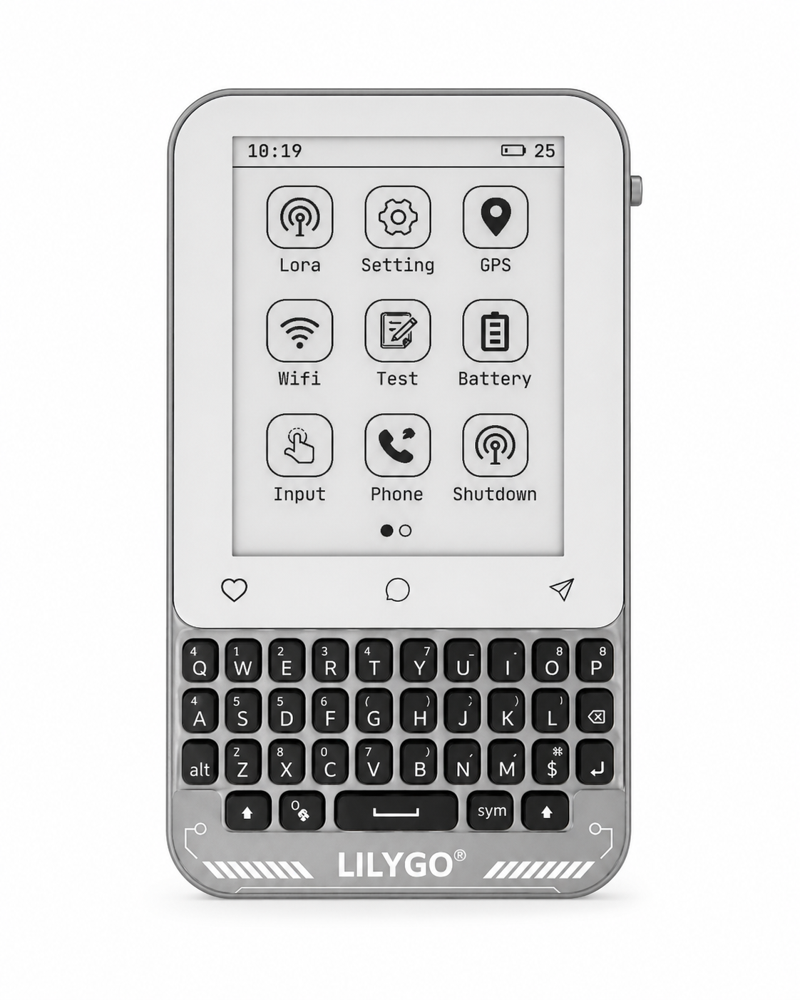
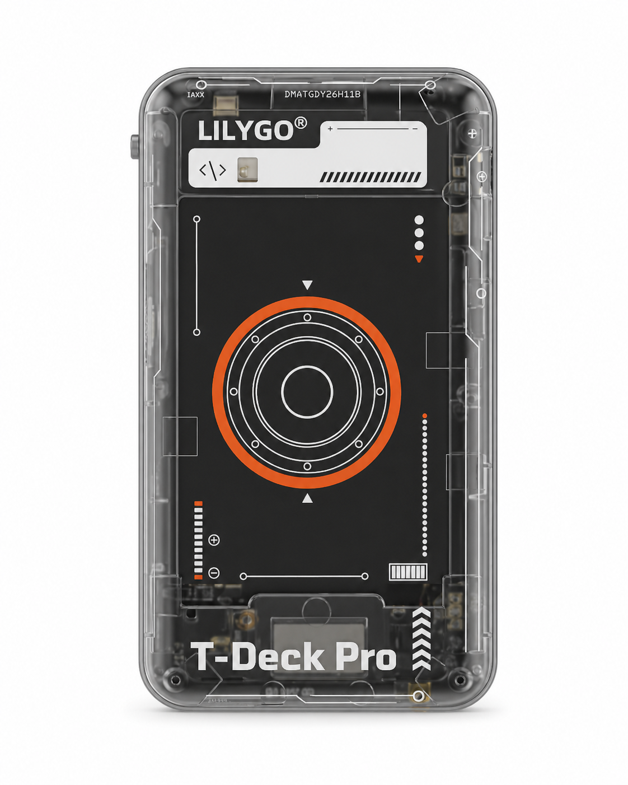
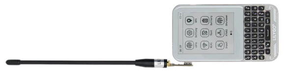
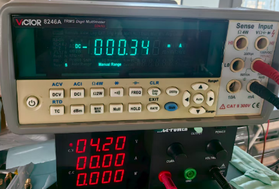

<h1 align = "center">🏆T-Deck-Pro MAX 🏆</h1>

|  [中文](./readme_cn.md) |  [English](./readme.md) |
| --- | --- |

<!-- </a> -->
</a>
</a>

| 正面 | 反面 |
| :---: | :---: |
|  |  |

## :zero: 版本更新 🎁

**T-Deck-MAX** 更新说明：

- 新增 XL9555 IO 扩展芯片

- 取消音频版和 4G 版的区别，将 4G (A7682E) 和音频 (ES8311) 集成到同一开发板

- 新增 LoRa 天线选择开关，通过 XL9555 控制选择内置或外置天线，默认为内置天线

- 新增音频通道输出选择开关，通过 XL9555 控制选择 A7682E / ES8311 音频输出

- 新增振动马达驱动芯片 DRV2605

### 1、如何确认是否为 T-Deck-MAX

下载 [WireScan](./firmware/examples/WireScan.bin) 固件，打开串口确认模组是否正常

如何下载固件？ - [点击这里](./firmware/)

### 2、购买渠道

[LilyGo 官方商城](https://lilygo.cc/products/t-deck-pro)

## :one: 产品规格 🎁

|       参数       |      T-Deck-MAX          |
| :--------------: | :----------------------------: |
|       MCU        |            ESP32-S3            |
|  Flash / PSRAM   |            16M / 8M            |
|       LoRa       |             SX1262             |
|       GPS        |            MIA-M10Q            |
|     显示屏       |      GDEQ031T10 (320x240)      |
|    4G 模块      |             A7682E             |
| 电池容量 |          3.7V-1500mAh          |
|   电池芯片   | BQ25896 (0x6B), BQ27220 (0x55) |
|      音频       |         ES8311 (0x18)          |
|      触摸       |         CST328 (0x1A)          |
|    陀螺仪     |        BHI260AP (0x28)         |
|     键盘     |         TCA8418 (0x34)         |
|   IO 扩展   |         XL9555 (0x20)          |
|      马达       |         DRV2605 (0x5A)         |

## :two: 模块说明 🎁

### 1. A7682E

A7682E https://en.simcom.com/product/A7682E.html

A7682E 是 LTE Cat 1 模块，支持 LTE-FDD/GSM/GPRS/EDGE 无线通信模式。下行最大 10Mbps，上行最大 5Mbps。A7682E 支持多种内置网络协议。

插入 SIM 卡后支持打电话、收发短信和上网功能

使用 [`examples/A7682E/test_AT`](https://github.com/Xinyuan-LillyGO/T-Deck-Pro/tree/master/examples/A7682E/test_AT) 测试 A7682E 功能

AT 命令控制
~~~
频段 LTE-FDD B1/B3/B5/B7/B8/B20
GSM/GPRS/EDGE 900/1800 MHz
供电电压 3.4V ~ 4.2V，典型值：3.8V
LTE Cat 1   (上行最大 5Mbps，下行最大 10Mbps)
EDGE        (上行/下行最大 236.8Kbps)
GPRS        (上行/下行最大 85.6Kbps)
支持 USB/FOTA 固件升级
支持语音通话
支持收发短信
网络协议 (TCP/IP/IPV4/IPV6/Multi-PDP/FTP/FTPS/HTTP/HTTPS/DNS)
RNDIS/PPP/ECM
SSL
~~~
❗ 注意：A7682E 和 ES8311 的扬声器是共用的。将 `XL9555` 的 `IO12` 设为 `HIGH` 可输出 A7682E 音频。
声音太小时：将 `XL9555` 的 `IO06` 设为 `HIGH` 启用功率放大器。[示例](./examples/A7682E/test_AT/test_AT.ino)

### 2. ES8311

❗ 注意：A7682E 和 ES8311 的扬声器是共用的。将 `XL9555` 的 `IO12` 设为 `LOW` 可输出 ES8311 音频。
声音太小时：将 `XL9555` 的 `IO06` 设为 `HIGH` 启用功率放大器。

### 3. LoRa

❗ 注意：
| 使用外置天线时，LoRa 工作方式如下图所示：  需要将 `XL9555` 的 `IO04` 设为 `HIGH`。  当 `XL9555` 的 `IO04` 为 `LOW` 时，使用内置天线（默认模式）。 |
| :---------------------------------------------------------------------------------------------------------------------------------------------------------------------------------------------------------------------------------- |
|  |

## :three: 示例说明 🎁

以下列出所有示例，帮助你快速上手各个模块的使用方法：

| 示例 | 路径 | 说明 |
| :--- | :--- | :--- |
| **WireScan** | `examples/WireScan/` | I2C 设备扫描，下载后打开串口监视器确认模组是否正常 |
| **test_wifi** | `examples/test_wifi/` | WiFi 连接测试 |
| **test_BHI260AP** | `examples/test_BHI260AP/` | 陀螺仪(BHI260AP)测试 |
| **test_GPS** | `examples/test_GPS/` | GPS(MIA-M10Q)模块测试 |
| **keypad** | `examples/keypad/` | 键盘输入测试 |
| **XL9555/read** | `examples/XL9555/read/` | IO 扩展芯片读取示例 |
| **XL9555/write** | `examples/XL9555/write/` | IO 扩展芯片写入示例 |
| **Elink_paper/touch** | `examples/Elink_paper/touch/` | 触摸屏基础测试 |
| **Elink_paper/display** | `examples/Elink_paper/display/` | 电子纸屏幕显示示例 |
| **Elink_paper/test_lvgl** | `examples/Elink_paper/test_lvgl/` | LVGL 图形库示例 |
| **Elink_paper/GDEQ031T10_Arduino** | `examples/Elink_paper/GDEQ031T10_Arduino/` | 电子纸 Arduino 库驱动示例 |
| **LoRa_sx1262/lora_send** | `examples/LoRa_sx1262/lora_send/` | LoRa 发送示例 |
| **LoRa_sx1262/lora_recv** | `examples/LoRa_sx1262/lora_recv/` | LoRa 接收示例 |
| **A7682E/test_AT** | `examples/A7682E/test_AT/` | 4G 模块 AT 命令测试 |
| **ES8311/playWAV** | `examples/ES8311/playWAV/` | 播放 WAV 音频示例 |
| **ES8311/playFormSD** | `examples/ES8311/playFormSD/` | 从 TF 卡播放音频示例 |
| **battery/bq25896** | `examples/battery/bq25896/` | 电池管理芯片 BQ25896 测试 |
| **battery/bq27220** | `examples/battery/bq27220/` | 电池电量计 BQ27220 测试 |
| **battery/sy6974** | `examples/battery/sy6974/` | 电池充电芯片 SY6974 测试 |
| **motor/basic** | `examples/motor/basic/` | 振动马达基础示例 |
| **motor/audio** | `examples/motor/audio/` | 振动马达音频反馈示例 |
| **motor/realtime** | `examples/motor/realtime/` | 振动马达实时控制示例 |
| **motor/complex** | `examples/motor/complex/` | 振动马达复杂模式示例 |
| **tf_card** | `examples/tf_card/` | TF 卡读写测试 |
| **eng_test** | `examples/eng_test/` | 整机功能综合测试 |

### 快速开始建议

1. **首次使用**：先刷入 `WireScan` 固件，确认模组 I2C 通信正常
2. **显示相关**：从 `Elink_paper/touch` 或 `Elink_paper/display` 开始
3. **无线通信**：WiFi 测试用 `test_wifi`，LoRa 用 `lora_send`/`lora_recv`
4. **4G 通信**：使用 `A7682E/test_AT` 测试 AT 命令
5. **音频功能**：先尝试 `ES8311/playWAV`，播放 WAV 文件
6. **电池相关**：使用 `battery/bq25896` 查看电池状态

## :four: 快速开始 🎁

🟢 推荐使用 PlatformIO，因为这些示例都是基于它开发的 🟢

### 1、PlatformIO

1. 安装 [Visual Studio Code](https://code.visualstudio.com/) 和 [Python](https://www.python.org/)，克隆或下载项目
2. 在 VisualStudioCode 扩展中搜索 `PlatformIO` 插件并安装
3. 安装完成后需要重启 `VisualStudioCode`
4. 打开本项目后，PlatformIO 会自动下载所需的三方库和依赖项，首次过程较长，请耐心等待
5. 依赖安装完成后，打开 `platformio.ini` 配置文件，在 `example` 中取消注释选择例程，然后按 `ctrl+s` 保存 `.ini` 配置文件
6. 点击 VScode 下的 :ballot_box_with_check: 编译项目，然后插入 USB 并在 VScode 中选择 COM 口
7. 最后点击 :arrow_right: 按钮下载程序到 Flash

### 2、Arduino IDE

1. 安装 [Arduino IDE](https://www.arduino.cc/en/software)

2. 将项目 `lib/` 下的所有文件复制到 Arduino 库路径（通常为 `C:\Users\YourName\Documents\Arduino\libraries`）

3. 打开 Arduino IDE，点击左上角 `File->Open` 打开本项目下 `example/xxx/xxx.ino` 中的示例

4. 然后配置 Arduino。按照以下方式配置完成后，点击 Arduino 左上角的按钮编译下载

| Arduino IDE 设置                  | 值                               |
| ------------------------------------ | ---------------------------------- |
| 开发板                                | ***ESP32S3 Dev Module***           |
| 端口                                 | 你的端口                           |
| USB CDC On Boot                      | 启用                              |
| CPU Frequency                        | 240MHZ(WiFi)                       |
| Core Debug Level                     | 无                                |
| USB DFU On Boot                      | 禁用                              |
| Erase All Flash Before Sketch Upload | 禁用                              |
| Events Run On                        | Core1                             |
| Flash Mode                           | QIO 80MHZ                          |
| Flash Size                           | **16MB(128Mb)**                    |
| Arduino Runs On                      | Core1                             |
| USB Firmware MSC On Boot             | 禁用                              |
| Partition Scheme                     | **16M Flash(3M APP/9.9MB FATFS)**  |
| PSRAM                                | **OPI PSRAM**                      |
| Upload Mode                          | **UART0/Hardware CDC**             |
| Upload Speed                         | 921600                            |
| USB Mode                             | **CDC and JTAG**                   |

## :five: 引脚定义 🎁

~~~c
#pragma once

/**  I2C 地址
 * 0x18 --- ES8311
 * 0x1A --- 触摸
 * 0x20 --- XL9555
 * 0x28 --- 陀螺仪
 * 0x34 --- 键盘
 * 0x55 --- BQ27220
 * 0x5A --- 马达
 * 0x6B --- BQ25896
 */
#define BOARD_I2C_ADDR_ES8311      0x18
#define BOARD_I2C_ADDR_TOUCH       0x1A
#define BOARD_I2C_ADDR_XL9555      0x20
#define BOARD_I2C_ADDR_GYROSCOPDE  0x28
#define BOARD_I2C_ADDR_KEYBOARD    0x34
#define BOARD_I2C_ADDR_BQ27220     0x55
#define BOARD_I2C_ADDR_MOTOR       0x5A
#define BOARD_I2C_ADDR_BQ25896     0x6B

// IIC
#define BOARD_I2C_SDA  13
#define BOARD_I2C_SCL  14

// XL9555 IO 扩展
#define BOARD_XL9555_INT            (-1)
#define BOARD_XL9555_SDA            BOARD_I2C_SDA
#define BOARD_XL9555_SCL            BOARD_I2C_SCL
#define BOARD_XL9555_00_6609_EN     (0)     // HIGH: 启用 A7682E 电源
#define BOARD_XL9555_01_LORA_EN     (1)     // HIGH: 启用 SX1262 电源
#define BOARD_XL9555_02_GPS_EN      (2)     // HIGH: 启用 GPS 电源
#define BOARD_XL9555_03_1V8_EN      (3)     // HIGH: 启用 BHI260AP 电源
/* LORA_SEL 决定使用内置天线还是外置天线
/  连接到 XL9555 IO04
/   HIGH --- 内置天线
/   LOW --- 外置天线  */
#define BOARD_XL9555_04_LORA_SEL    (4)
#define BOARD_XL9555_05_MOTOR_EN    (5)     // HIGH: 启用 DRV2605 电源
// 连接到 XL9555 IO06，启用功率放大器，
// 增加扬声器音量
#define BOARD_XL9555_06_AMPLIFIER    (6)     // HIGH: 启用功率放大器
#define BOARD_XL9555_07_TOUCH_RST   (7)     // LOW: 复位触摸
#define BOARD_XL9555_10_PWEKEY_EN   (8)     // HIGH: 启用 A7682E POWERKEY
#define BOARD_XL9555_11_KEY_RST     (9)     // LOW: 复位键盘
/* A7682E 和 ES8311 模块共用耳机和扬声器输出
/  通过 AUDIO_SEL 选择音频输出。当 AUDIO_SEL 为
/  HIGH : 耳机和扬声器输出 A7682E 的声音
/  LOW :  耳机和扬声器输出 ES8311 的声音 */
#define BOARD_XL9555_12_AUDIO_SEL   (10)
#define BOARD_XL9555_13             (11)    // 保留
#define BOARD_XL9555_14             (12)    // 保留
#define BOARD_XL9555_15             (13)    // 保留
#define BOARD_XL9555_16             (14)    // 保留
#define BOARD_XL9555_17             (15)    // 保留

// 键盘
#define BOARD_KEYBOARD_SCL BOARD_I2C_SCL
#define BOARD_KEYBOARD_SDA BOARD_I2C_SDA
#define BOARD_KEYBOARD_INT 15
#define BOARD_KEYBOARD_LED 42
#define BOARD_KEYBOARD_RST BOARD_XL9555_11_KEY_RST  // 连接到 XL9555 的 IO11

// 触摸
#define BOARD_TOUCH_SCL BOARD_I2C_SCL
#define BOARD_TOUCH_SDA BOARD_I2C_SDA
#define BOARD_TOUCH_INT 12
#define BOARD_TOUCH_RST BOARD_XL9555_07_TOUCH_RST   // 连接到 XL9555 的 IO07

// 陀螺仪
#define BOARD_GYROSCOPDE_SCL BOARD_I2C_SCL
#define BOARD_GYROSCOPDE_SDA BOARD_I2C_SDA
#define BOARD_GYROSCOPDE_INT 21
#define BOARD_GYROSCOPDE_RST -1

// 马达
#define BOARD_MOTOR_SCL BOARD_I2C_SCL
#define BOARD_MOTOR_SDA BOARD_I2C_SDA
#define BOARD_MOTOR_EN BOARD_XL9555_05_MOTOR_EN     // 连接到 XL9555 的 IO05

// ES8311
#define BOARD_ES8311_SCL BOARD_I2C_SCL
#define BOARD_ES8311_SDA BOARD_I2C_SDA
#define BOARD_ES8311_MCLK       38
#define BOARD_ES8311_SCLK       39
#define BOARD_ES8311_ASDOUT     40
#define BOARD_ES8311_LRCK       18
#define BOARD_ES8311_DSDIN      17

// SPI
#define BOARD_SPI_SCK  36
#define BOARD_SPI_MOSI 33
#define BOARD_SPI_MISO 47

// 显示屏
#define BOARD_EPD_BL   41
#define BOARD_EPD_SCK  BOARD_SPI_SCK
#define BOARD_EPD_MOSI BOARD_SPI_MOSI
#define BOARD_EPD_DC   35
#define BOARD_EPD_CS   34
#define BOARD_EPD_BUSY 37
#define BOARD_EPD_RST  9

// TF 卡
#define BOARD_SD_CS   48
#define BOARD_SD_SCK  BOARD_SPI_SCK
#define BOARD_SD_MOSI BOARD_SPI_MOSI
#define BOARD_SD_MISO BOARD_SPI_MISO

// Lora
#define BOARD_LORA_SCK  BOARD_SPI_SCK
#define BOARD_LORA_MOSI BOARD_SPI_MOSI
#define BOARD_LORA_MISO BOARD_SPI_MISO
#define BOARD_LORA_CS   3
#define BOARD_LORA_BUSY 6
#define BOARD_LORA_RST  4
#define BOARD_LORA_INT  5

// GPS
#define BOARD_GPS_RXD 2
#define BOARD_GPS_TXD 16
#define BOARD_GPS_PPS 1

// A7682E 模块
#define BOARD_A7682E_RI     7
#define BOARD_A7682E_ITR    8
#define BOARD_A7682E_RXD    10
#define BOARD_A7682E_TXD    11
#define BOARD_A7682E_PWRKEY BOARD_XL9555_10_PWEKEY_EN   // 连接到 XL9555 扩展芯片的 IO10

// Boot 引脚
#define BOARD_BOOT_PIN  0
~~~

## :six: 功耗测试 🎁

待机功耗

## :seven: 常见问题 🎁

## :eight: 原理图 & 3D 模型 🎁

更多资料请查看 `./hardware` 目录

----
